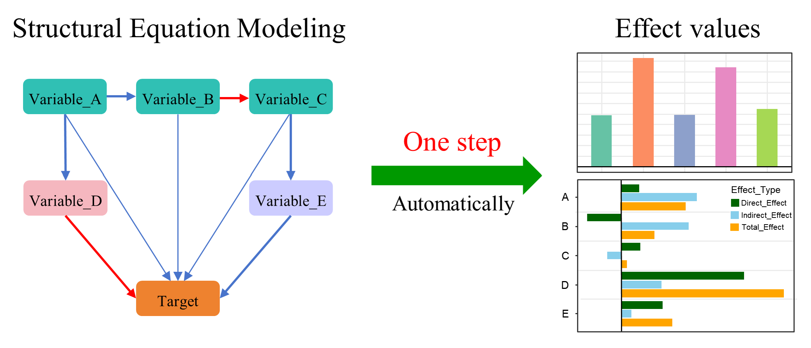
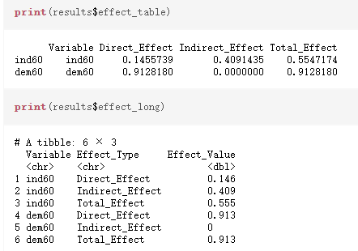
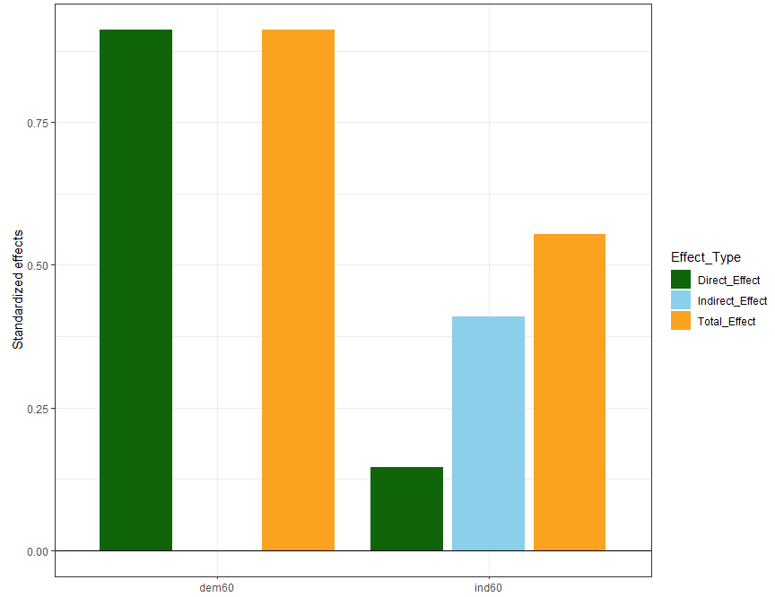
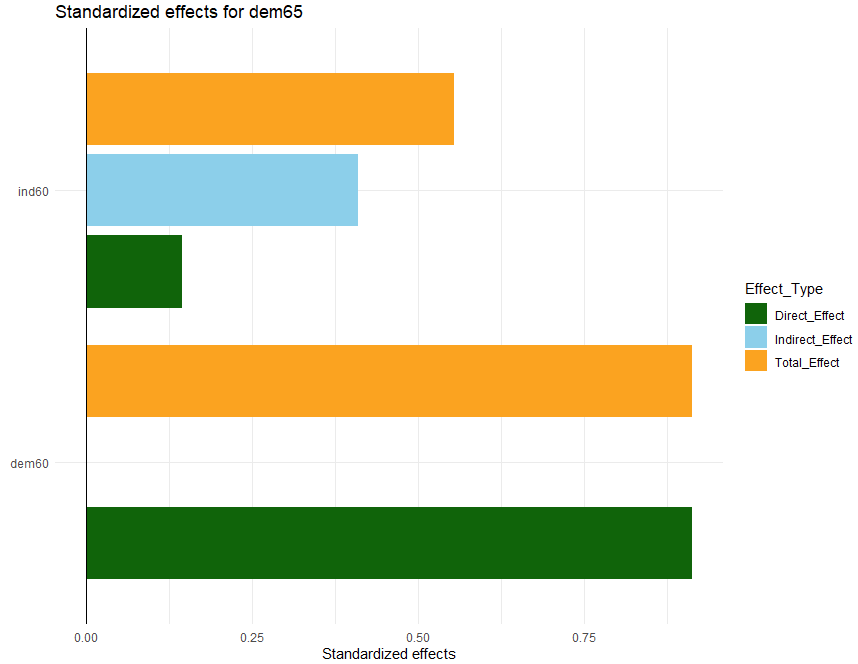
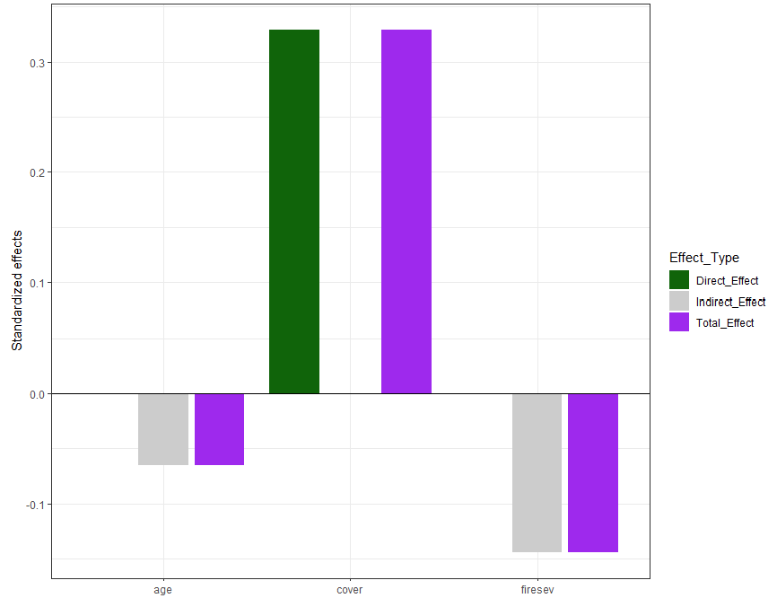
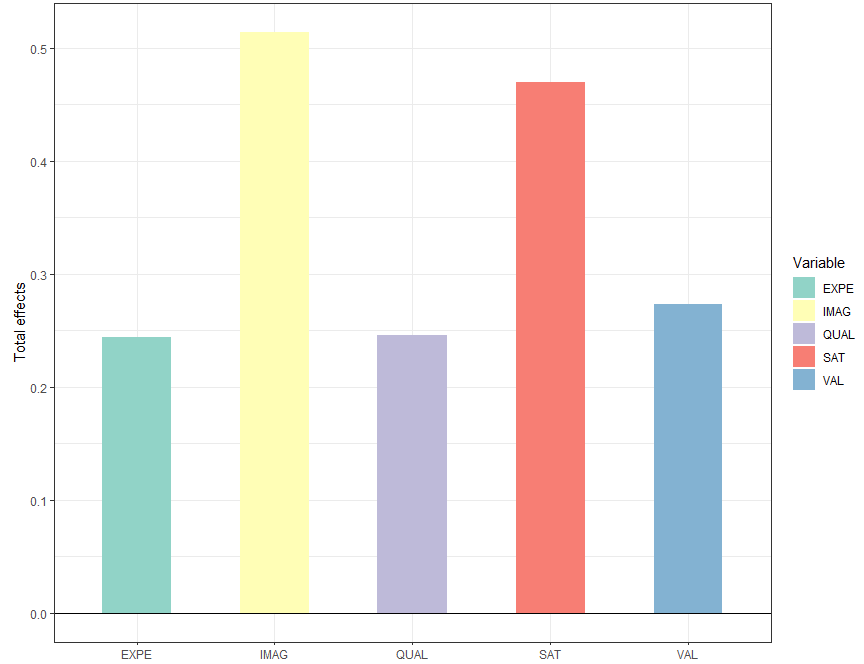

# semEffect: One-step effect analysis and visualization for structural equation models in R

This R package 'semEffect' provides standardized effect decomposition (direct, indirect, and total effects) for three major structural equation modeling frameworks: 'lavaan', 'piecewiseSEM', and 'plspm'. 
Automatically handles zero-effect variables, generates publication-ready 'ggplot2' visualizations, and returns both wide-format and long-format effect tables. 
Supports effect filtering, multi-model object inputs, and customizable visualization parameters. 

## Citation

Mei W, Jiang L, Song M, Li J, Luo C (2025) semEffect: One-step effect analysis and visualization for structural equation models in R. R package version 1.2.2.

## 1. Install 'semEffect' package in R

### Option 1: from CRAN:

	 install.packages("semEffect")

### Option 2: from Github:

	 install.packages("devtools")
	 devtools::install_github("PhDMeiwp/semEffect", dependencies = TRUE)

### Option 3: from gitee:

	 install.packages("git2r")
	 install.packages("remotes")
	 library(git2r)
	 library(remotes)
	 remotes::install_git("https://gitee.com/openResearch/semEffect.git")  

## 2. Usage

	 sem_effects(
	  object,
	  target,
	  plot = TRUE,
	  total_only = FALSE,
	  total_colors = "skyblue",
	  color_palette = c("darkgreen", "skyblue", "orange")
	 )

	
## 3. Examples

	 library(semEffect)

### Example 01: lavaan -------------------------------

	 library(lavaan)

	 model <- '
	  # Measurement model
	  ind60 =~ x1 + x2 + x3
	  dem60 =~ y1 + y2 + y3 + y4
	  dem65 =~ y5 + y6 + y7 + y8

	  # Structural model
	  dem60 ~ ind60
	  dem65 ~ ind60 + dem60
	 '
	 fit <- sem(model, data = PoliticalDemocracy)

	 # Analyze effects for target variable "dem65"
	 results <- sem_effects(fit, target = "dem65")
	 
	 #--- Not run ----
	 library(semPlot)
	 semPaths(fit, what="std", nCharNodes=0)  #plot SEM
	 #--- End Not run ---

	 print(results$effect_table)
	 print(results$effect_long)
	 print(results$plot_object)	 
	 

	 # Customize plot appearance
	 results$plot_object +
	   ggplot2::coord_flip()+
	   ggplot2::theme_minimal() +
	   ggplot2::ggtitle("Standardized effects for dem65")

### Example 02: piecewiseSEM --------------------------

	 library(piecewiseSEM)
	 
	 pmod <- psem(
	  lm(rich ~ cover, data = keeley),
	  lm(cover ~ firesev, data = keeley),
	  lm(firesev ~ age, data = keeley),
	  data = keeley
	  )
	  
	 #--- Not run ---
	 plot(pmod)   #plot SEM
	 #--- End Not run ---
	 
	 sem_effects(pmod, target = "rich",
			color_palette = c("darkgreen", "grey80", "purple"))

### Example 03: plspm ---------------------------------

	 library(plspm)
	 data(satisfaction)

	 # path matrix
	 IMAG = c(0,0,0,0,0,0)
	 EXPE = c(1,0,0,0,0,0)
	 QUAL = c(0,1,0,0,0,0)
	 VAL = c(0,1,1,0,0,0)
	 SAT = c(1,1,1,1,0,0)
	 LOY = c(1,0,0,0,1,0)
	 sat_path = rbind(IMAG, EXPE, QUAL, VAL, SAT, LOY)

	 # blocks of outer model
	 sat_blocks = list(1:5, 6:10, 11:15, 16:19, 20:23, 24:27)

	 # vector of modes (reflective indicators)
	 sat_mod = rep("A", 6)

	 # apply plspm
	 plsmodel = plspm(satisfaction, sat_path, sat_blocks, modes = sat_mod)
	 
	 #--- Not run ---
	 innerplot(plsmodel)  #plot SEM
     #--- End Not run ---

	 sem_effects(plsmodel, target = "LOY", plot = TRUE, delete_zero_effect = TRUE,
				total_only = TRUE,
				total_color = RColorBrewer::brewer.pal(5,"Set2"))

## 4. Contact

- Bugs and feature requests can be filed to https://github.com/PhDMeiwp/semEffect/issues. 
- BTW, [Pull requests](https://github.com/PhDMeiwp/semEffect/pulls) are also welcome.